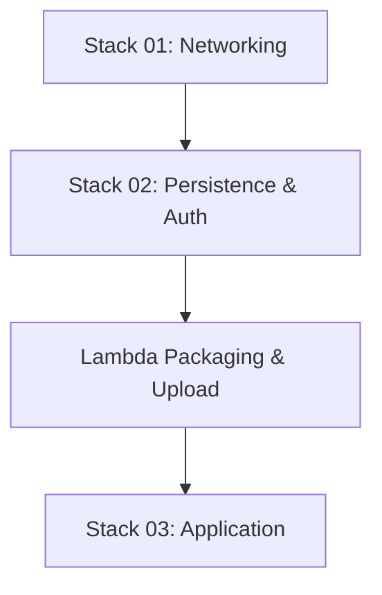

# Design: Cloud Deployment

## Architecture Overview
The deployment follows a layered approach using AWS CloudFormation stacks. This ensures that cross-stack dependencies are resolved sequentially.

### Stack Dependencies

### Components
1.  **Networking (VPC)**: Isolated environment with public and private subnets. Lambda functions are deployed in private subnets for security.
2.  **Persistence (DynamoDB)**: A single table with GSIs to support URL lookups and user listings.
3.  **Auth (Cognito)**: User Pool and Client for securing the API.
4.  **Application (Lambda/API Gateway)**: The business logic layer. Lambda functions consume shared code via a Lambda Layer.

## Deployment Strategy
We use the AWS CLI for orchestration.
- **Artifact Management**: An S3 bucket (created in Stack 02) will host the `backend.zip` and `layer.zip` artifacts.
- **Inter-stack Communication**: Stack 03 consumes outputs (IDs/Names) from Stacks 01 and 02 via CloudFormation parameters.

## Verification Strategy
- **Health Check**: Verify API Gateway endpoint returns successful responses.
- **Integration**: Perform a test URL creation and retrieval using a test user account.
