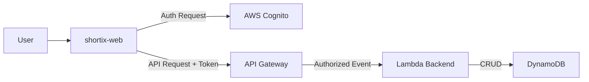

# Design: Web-Backend Integration

## Architecture

## Authentication Strategy
- **Library**: `amazon-cognito-identity-js`
- **Flow**:
  1. User enters credentials.
  2. Frontend authenticates with Cognito User Pool.
  3. Cognito returns ID Token, Access Token, Refresh Token.
  4. Frontend stores session (managed by SDK).

## API Authorization
- **Mechanism**: Bearer Token (ID Token).
- **Implementation**:
  - `axios` interceptor retrieves current session.
  - Adds `Authorization: <id_token>` header to every request.
  - If no session, no header is added (public endpoints not currently in scope for this integration, assuming all protected).

## Configuration
- Environment variables in `.env`:
  - `VITE_USER_POOL_ID`: From `shortix-infra` output.
  - `VITE_CLIENT_ID`: From `shortix-infra` output.
  - `VITE_API_URL`: From `shortix-infra` output.
